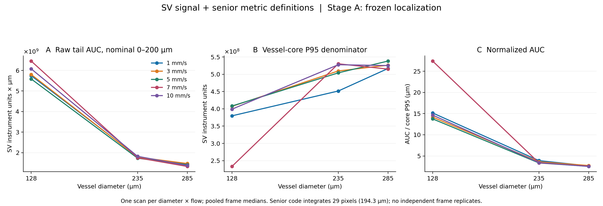
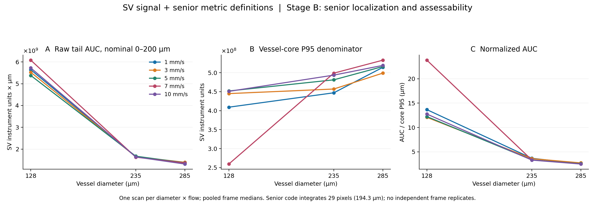
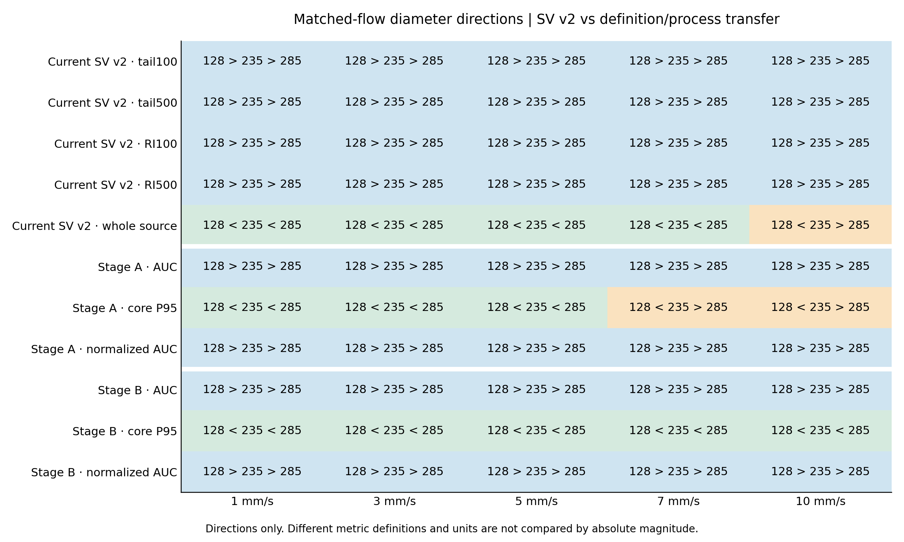

# SV + 师兄拖尾指标定义迁移分析

Stage A 与 Stage B 均已完成，使用与正式 SV v2 完全相同的 15 卷 retained SV_raw。正式信号仍为 `var(abs(IMG),1,3)`，方差分母 N；dx=12.7 μm/px，dz=6.7 μm/px。旧结果和 geometry 均保持只读。

## 主要结果

| 指标与执行前冻结形态 | Stage A 满足流速 | Stage B 满足流速 |
|---|---|---|
| raw_AUC_200: D128 < D235 > D285 | 0/5；[] mm/s | 0/5；[] mm/s |
| vessel_core_P95: D128 < D235 < D285 | 3/5；[1, 3, 5] mm/s | 5/5；[1, 3, 5, 7, 10] mm/s |
| normalized_AUC_um: D128 > D235 > D285 | 5/5；[1, 3, 5, 7, 10] mm/s | 5/5；[1, 3, 5, 7, 10] mm/s |

Stage A 未满足各形态的流速：
- raw_AUC_200：[1, 3, 5, 7, 10] mm/s。
- vessel_core_P95：[7, 10] mm/s。
- normalized_AUC_um：[] mm/s。

## 与正式 SV v2 的方向比较

正式 tail100、tail500、RI100、RI500 在五个匹配流速均为 D128 > D235 > D285。下表保留新方法每一个流速的方向；不同单位之间不比较数值大小。

| Flow (mm/s) | A: AUC | A: P95 | A: normalized | B: AUC | B: P95 | B: normalized |
|---|---|---|---|---|---|---|
| 1 | D128>D235>D285 | D128<D235<D285 | D128>D235>D285 | D128>D235>D285 | D128<D235<D285 | D128>D235>D285 |
| 3 | D128>D235>D285 | D128<D235<D285 | D128>D235>D285 | D128>D235>D285 | D128<D235<D285 | D128>D235>D285 |
| 5 | D128>D235>D285 | D128<D235<D285 | D128>D235>D285 | D128>D235>D285 | D128<D235<D285 | D128>D235>D285 |
| 7 | D128>D235>D285 | D128<D235>D285 | D128>D235>D285 | D128>D235>D285 | D128<D235<D285 | D128>D235>D285 |
| 10 | D128>D235>D285 | D128<D235>D285 | D128>D235>D285 | D128>D235>D285 | D128<D235<D285 | D128>D235>D285 |

Whole-source mean 与 vessel-core P95 的范围、横向汇总和背景处理不同。正式 source 在 1/3/5/7 mm/s 递增，10 mm/s 为 D128 < D235 > D285。Stage A 的 P95 相比 source 仅在 7 mm/s 改变这一直径方向；Stage B 又使 7/10 mm/s 的 P95 均变为递增。完整三直径排序见 `comparison/metric_definition_direction_ledger.csv`。

## 对四个问题的判断

迁移指标定义后，absolute AUC 的中间直径峰值在五个流速均未出现；进一步迁移定位与 assessability 后仍未出现。AUC 与 normalized AUC 的直径排序均保持正式 tail/RI 的递减方向。因此本轮不能把既有 absolute-tail 形态差异解释为单纯的指标定义差异。

Denominator 对定义与定位流程更敏感：Stage A 在 7 mm/s 相比当前 whole-source 排序发生改变；Stage B 在 7/10 mm/s 相比 Stage A 改变排序，并且相同 common support 下仍然改变。这支持定位对 denominator 方向有影响，不能仅归于帧覆盖变化；它不证明某个因素就是历史差异的原因。

Normalized endpoint 虽与师兄同向，却也与当前正式 RI 同向，不能据此称迁移后完整三联图得到复现。对于未出现的 raw-AUC 中间峰，在同一数据和 SV 信号下迁移两阶段流程仍不能得到师兄形态，使 signal algorithm / dataset 对差异的贡献更值得考虑；本轮不能单独区分 OMAG 算法与两套原始数据，也不进行机制归因。

## 定位与覆盖比较

Stage A 保留全部 7500 个 nominal positions，其中原 geometry valid 7018，原 invalid 482；原 invalid 的指标仍为 NaN。Stage A 新增 ROI 可评估数 7018，AUC 有效数 7018，denominator 有效数 7018，normalized 有效数 7018。

Stage B 在原始 0–499 空间序列上运行师兄 alpha=0.15 定位、X4 与 body assessability，未覆盖冻结字段。完整流程 assessable 数 7487，AUC 有效纳入数 7487，normalized 有效纳入数 7486。

Common support 分别针对 AUC、P95、normalized endpoint 取 A/B 同时纳入的位置。`comparison/stageA_stageB_common_support.csv` 保留各自 median、共同帧 median、差值和纳入变化；`stageA_stageB_support_trends.csv` 对两类 support 分别判断趋势。

raw_AUC_200：共同帧集合总计 7007，每卷 424–494 个位置。共同 support 下 A/B 方向保持的 flow 为 [1, 3, 5, 7, 10]，改变的 flow 为 [] mm/s。

vessel_core_P95：共同帧集合总计 7006，每卷 424–494 个位置。共同 support 下 A/B 方向保持的 flow 为 [1, 3, 5]，改变的 flow 为 [7, 10] mm/s。

normalized_AUC_um：共同帧集合总计 7006，每卷 424–494 个位置。共同 support 下 A/B 方向保持的 flow 为 [1, 3, 5, 7, 10]，改变的 flow 为 [] mm/s。

各自 support 的总差值在 CSV 中分解为 A-native→A-common、A-common→B-common、B-common→B-native 三项。这是描述性差值分解：共同帧上的变化对应定位改变后的指标，support 项对应帧集合改变，不能据此进行因果归因。

## 代码审计中必须保留的定义

- 师兄正式入口调用 `formal_9scan_freeze._interval_result`，其 `_window_pixels(0)` 返回 1。因此名义 0–200 μm 实际为 `[tail_start+1, tail_start+30)`，共 29 像素、194.3 μm。操作性 `tail_start=z_lower+2` 保留，实际首个积分样本相对 z_lower 为 +3 px。未修正该历史实现。
- 旧 generic/development helper 使用 0 起点，得到 30 像素；本次使用正式 freeze 入口。图中明确为 nominal 0–200 μm。
- 先 round(D/dx)，再计算 central/background 宽度及 gap。D128/D235/D285 central 宽度分别为 4/8/9 px；单侧 background 为 3/6/7 px，gap 为 2/5/6 px。
- 左右背景像素合并后逐深度取 median；central 同样取 median，E=max(P−B,0)。AUC 为 sum×dz。
- D/dz 取整为 19/35/43 px；core 相对整数化 z_top 为 [2,9)、[4,16)、[5,20)，P95 使用 NumPy 默认 linear quantile。
- 原 frozen z_top 以边界坐标保存，可能为半整数。新方法严格使用 Python ties-to-even round，另存 z_upper_metric；x4_frozen/z_top_frozen 原值未改。
- denominator 必须 finite 且 >1e-12。无效主字段为 NaN，候选值另存 denominator_candidate。normalized=AUC/P95，单位 μm，正式 runner 不加 epsilon。
- Stage A 只使用几何/有限值/ROI/窗口可定义性，不提前施加 Stage B 的 body assessability score。扫描值遵循 pooled median；denominator 主汇总限于 AUC 纳入帧且 P95 有效。
- Stage B 使用相对 SNR、原几何参数及 >=0.60 assessability 阈值，uncertain 不纳入主值。numeric floor 原值保留并核查；未做 SV 尺度映射或调参。MATLAB Thr=85 dB 属于 OMAG 重建，本次不执行。
- `senior_source/` 保存实际读取代码的字节相同快照与配置，完整 source SHA 和文档差异见 `senior_method_contract.json`。
- Stage B 定位与 assessability 使用师兄加载器原有的 float32 内存副本；指标仍使用原 retained SV_raw 精度。补齐加载精度后重算了全部 Stage B，修正前表仅在 validation/ 的 DIAGNOSTIC_ONLY 目录保留，不进入最终分析。初始合同原文、字段映射和修正记录见 `senior_code_audit.md`。

## 分析身份与解释边界

这是 method-definition transfer / sensitivity analysis，不是新的独立实验验证。历史师兄结果在分析前已知，因此不是盲验证或预注册。D128 与师兄 D185 不同，相似方向只能称 qualitative shape similarity，不能称 exact replication。

B-scan/frame 是 slow-axis 空间位置，不是时间重复。15 volumes 是 15 个 diameter×flow 条件扫描；每个条件仅一卷，不同 flow 不是同条件重复，也不是每个直径五次独立重复。本次不做 frame-level p-value、复杂模型或机制归因。

归一化结果必须结合 raw AUC 和 P95 同时解释。定义改变后趋势是否改变只能说明对定义/流程的敏感性；不能单独证明哪种定义是差异原因，也不能区分 OMAG 算法与两套原始数据的贡献。

## 验证与文件

验证状态：passed。7500 个数组均匹配原 export SHA，其中 7018 个逐一匹配固定 v2 的数组 SHA；45 个 Stage A 固定帧和 45 个 Stage B 固定帧独立重算公式；90 个 scan median 从 framewise 表独立重建；24 项 rounding/NaN/FOV 检查通过。冻结输入与历史文件 326 个 SHA 保持不变。

- `stageA/`、`stageB/`：7500 行 framewise、15 卷 summary、coverage、逐 flow contrasts/trends。
- `comparison/`：正式 v2 与迁移定义的方向 ledger，以及 A/B common-support 数值与趋势。
- `figures/`：SV 三联图与方向比较图，PNG/PDF。
- `validation/`、`validation.json`：数组身份、固定帧、rounding、NaN reason、独立 median 和尺度保护核验。
- `output_sha256.csv`：交付文件 SHA256（不含自身）。

复跑命令：在新 checkout 中保留相同输入布局及合同/来源快照，将本轮结果另行归档后，在固定 analysis/sv_senior_metric_transfer_v1 路径运行 `python -B run_transfer.py`、`python -B validate_compare_report.py`。最终 run_transfer 已包含 float32 定位步骤，无需再运行一次性 correct_stageB_loader_fidelity.py；脚本拒绝覆盖已有 volume_metrics。输入路径由 manifest 给出，不运行原始 OCT/OMAG 导出。

