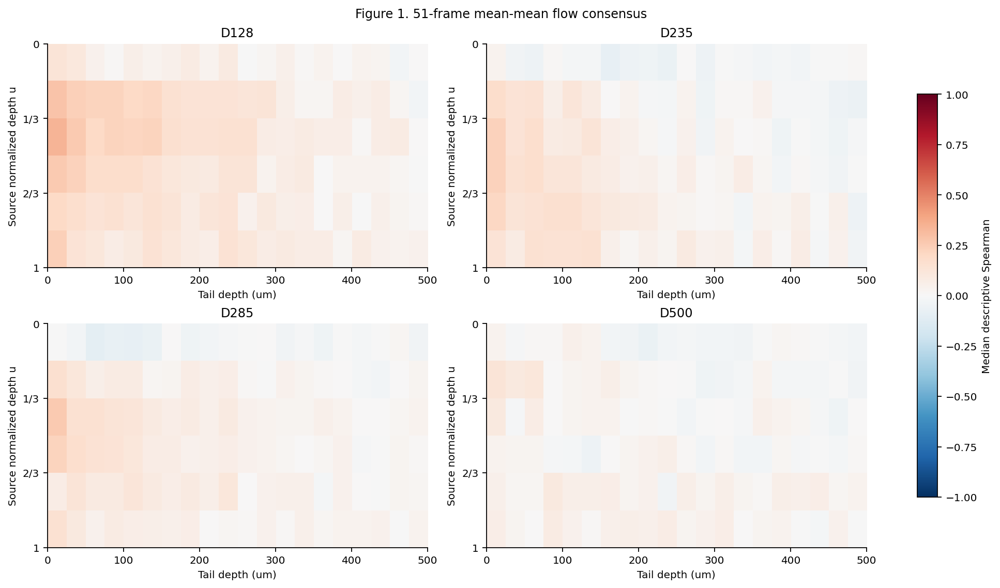

# SV-OCTA source-depth × tail-depth 二维空间耦合 v1

本目录只计算冻结 raw SV 的 within-volume descriptive spatial association：同一卷内哪个 source 归一化轴向位置的波动与哪个 tail 深度 band 的波动对应。正式实验单位为 scan volume，每个 diameter × flow 一卷；B-scan 和 map cell 均不作为独立实验重复。

起始 HEAD：`98af95d4e16f3e117362ae2ae8a3c2600cc36ddc`，分支 `analysis/sv-diameter-stage2`。本轮仅新增本目录；结果代码 commit 为包含本目录的 Git commit，最终远端 SHA 在交付消息中报告，避免将自引用 SHA 写入被提交文件。

## 分析层级与冻结定义

| 层级 | 固定定义 |
| --- | --- |
| Primary | 6 个 normalized source bins × 20 个不重叠 25 μm tail bands；linear raw SV mean；51-frame detrend；每卷 Spearman、lag=0 及 lag specificity；20 个 common-flow volumes |
| 第二坐标 | 6×5；tail 为直接按 0/0.2/…/1D 边界从 raw SV 积分的 bands，正式共同范围 0–1D |
| Sensitivity | source 4/8 bins；31/101-frame detrend；geometry controls；Q–Q 与 geometry diagnostics |
| 未启用的可选项目 | 10-bin exploratory analysis 未执行，D128 没有任何 10-bin 结果 |
| Secondary extension | D500 flow=2/9/12，单独标为 d500_extension，不进入五流速 consensus |

正式 `SV_raw = Var_t(|E|)`，即 `var(abs(IMG),1,3)`、方差分母 N。所有 mean/Q 使用 linear raw SV；无 log、CV²、normalization、gain、clipping、positive truncation 或 background subtraction。MATLAB 本轮未运行；读取既有正式 MAT/NPZ 的 `sv_raw`。

continuity-first v2.1 geometry 完全冻结：X4 为中心、X1 为表观横向跨度、z_top 为冻结上边界，X1≠physical diameter。Source 是原 X1×physical diameter 椭圆；dx=12.7 μm、dz=6.7 μm、16×16 supersample；u=(z−z_top)/D 使用物理单位，子像素 u∈[j/n,(j+1)/n)，最后一个 bin 包含 u=1。Tail 从真实物理 bottom 开始，guard=0、X1 宽矩形，无 cone/spreading。

`Q=Σ(sv_raw × fractional weight) × dx × dz`，area=Σweight×dx×dz，mean=Q/area。Source 4/6/8 bins 都是原椭圆与物理轴向 slab 的交集，未改矩形；tail boundaries 使用原 interval-overlap weights，未按像素取整。Normalized-tail 独立积分，既不插值 25 μm map，也不从已有粗窗口估计新 band Q。

**Q–Q analysis includes signal-intensity and ROI-geometry contributions and is secondary to mean–mean analysis.** 同时报告 source-band area、X1、source-area 与 tail-band Q 的相关；这些几何诊断并不分配独立的因果贡献比例。

## 输入身份、范围与验证

冻结几何、frame identities、source/旧三段/tail100/tail500 对照值来自上一轮 `analysis/sv_source_tail_framewise_coupling_v1/framewise_source_tail_metrics.csv`，SHA256 与其 validation 核对一致。D128 使用 `formal-sv-d128-v21-run001` release 的 25 个 ZIP、2,422 个有效 NPZ；D235/D285/D500 使用 8,509 个 retained formal MAT，逐一核对上一轮保存的数组 SHA256。

所有直接文件路径、SHA256、角色和字节数记录在 [input_manifest.csv](input_manifest.csv)，每帧数组/ZIP 成员身份见 [array_identity_audit.csv.gz](array_identity_audit.csv.gz)。D235 flow1 的本地 MAT 位于原 intake 工作树，其余新直径 MAT 位于 retained derived 目录；均只读，未从 `.oct` 重建。

| 范围 | volume 数 | 有效帧 | 名义帧 | 无效 geometry 帧 |
| --- | --- | --- | --- | --- |
| common_grid | 20 | 9456 | 10000 | 544 |
| d500_extension | 3 | 1475 | 1500 | 25 |
| 全部 | 23 | 10931 | 11500 | 569 |

4/6/8 source bins 的面积、Q 和加权 mean 每帧重构正式 source；六等分相邻两层还重构冻结 Upper/Middle/Lower。前四个 absolute tail bands 重构 tail100，全部二十层重构 tail500；normalized 5 bands 重构同帧直接积分的 0–D tail。各项最大误差见下表；所有门禁通过，没有遗漏有效帧。

| 重构/参考 | 最大绝对误差 | 最大相对误差 |
| --- | --- | --- |
| source_6_q_reconstruction | 0.015625 | 6.09515271e-16 |
| source_6_area_reconstruction | 5.82076609e-11 | 4.13885382e-16 |
| source_6_mean_reconstruction | 1.49011612e-07 | 7.3739965e-16 |
| tail100_q_reconstruction | 0.001953125 | 5.00027245e-16 |
| tail100_area_reconstruction | 1.45519152e-11 | 3.2737717e-16 |
| tail100_mean_reconstruction | 1.1920929e-07 | 6.80993258e-16 |
| tail500_q_reconstruction | 0.0078125 | 5.90801417e-16 |
| tail500_area_reconstruction | 1.16415322e-10 | 4.29682536e-16 |
| tail500_mean_reconstruction | 3.7252903e-08 | 8.61454843e-16 |
| stage2_volume_medians | 5.96046448e-08 | 1.07162557e-15 |

绝对误差按原值量纲记录；Q 数值较大，需同时读取相对误差。23 卷 source、tail100、tail500、RI 的 92 项中位数对照全部通过；RI 只作 Stage 2 冻结结果复核，不作为本轮 coupling 指标。

独立验证使用冻结全图 band/rectangle weights 重放 8 个数组、344 项积分；Q 最大相对误差 4.83e-16。按原始 frame 坐标重新构造移动窗口和配对，重算 5520 条 lag（最大绝对差 3.33e-16），逐条核对全部 13800 条 lag summary，另核对 92 个 scalar partial（最大绝对差 4.44e-16）、high-region 选择、consensus 与跨直径相似度；均通过。

## 计算约定与字段

所有计算在单一 scan volume 内进行。有效帧表只含正式有效 geometry；计算时重新索引到原始 0–499 整数网格，无效帧为 NaN，不补零、不插值、不删除后压缩帧距离。Centered moving median 在原坐标上取 31/51/101 帧窗口，端点截短、忽略邻域 NaN、min_periods=1，无效中心保持 NaN；residual 仅用于波动诊断，并非新的正式 SV。

每一对变量的 Spearman 都在 pairwise-valid 配对集合内重新排 average ranks，再作 Pearson；代码用共享有效集合的矩阵运算加速，同 scalar 算法独立核对。Lag=Δ 表示 Source(i) vs Tail(i+Δ)，Δ=−50…50，不循环；每个 lag 保存 n_pairs，最少/最多分别为 319/500，均通过端点与缺失帧计数检查。

rho_peak 为 lag 曲线最大的有符号 rho；并列取 |lag| 最小，再取较小有符号 lag。zero_lag_rank 为 1+严格高于 rho(0) 的 lag 数量；near±2/±5 分别按 |lag_at_peak|≤2/5。Specificity=rho(0)−median(rho at 30≤|lag|≤50)，远端共 42 个 lag。主 lag summary 含两坐标、6 bins、51 residual；所有 raw/31/51/101 曲线与 summaries 也完整保留。

Peak cell 由 lag=0 map 的最大 rho 确定，cell 并列按 source_bin 再 tail_bin；之后读取该 cell 的 lag 曲线。High-coupling region 只在 rho>0 的 cells 内取最高 ceil(0.10×正值 cell 数)，截止值相同的 cells 全部保留；若没有正值则为空。本次所有 map 均有正值；primary absolute 每卷实际选择的 cell 数由 high_actual_count 给出。它是离散 cell 集合，min–max 只是外包范围，不能把整个包围矩形解释成连续热区。

所有 source/tail 定位以 band 中点报告，并同时保留边界。u_high_region_min/max 和 tail_high_region_min/max 是入选 cell 中点极值；lo/hi 是完整 bins 边界外包范围。Across-flow 的“region median 范围”表示五卷各自 region 中位数的 min–max，与 consensus map 上重新选出的 region 是不同统计量；两者分别保存。

Partial Spearman 分别联合控制 source_area+z_top 和 X1+z_top：先对 complete cases 排秩，以截距和 control ranks 对 X/Y ranks 作 OLS 残差化，再计算 residual Pearson。在 detrended 模式，信号及 controls 均先作同窗口去趋势；raw 模式也单独保存。Controlled map 不另计算 lag，其位置摘要中的 specificity/lag 字段留空，不能当作缺失的已要求 primary lag 数据。

Flow consensus 仅用 common flows 1/3/5/7/10，在每个 cell 计算 rho median/min/max、正值卷数、near-zero 卷数与 specificity。Within-diameter similarity 使用同一坐标网格的 10 对 flow maps；cross-diameter similarity 使用各直径五流速 consensus。没有 pooled-frame correlation、frame-level p-value、t-test、ANOVA、mixed model 或其他推断检验。

4/6/8-bin 形状敏感性另以 source 坐标的最小公倍数分区做 piecewise-constant cell replication，计算 map-shape Spearman；这是已有相关图的形状诊断，不是新 SV、不是归一化 tail map 插值。绝对坐标为 0–500 μm/20 bands，d/D 为 0–1D/5 bands，覆盖物理范围和 band 宽度同时改变；两种 similarity 的比较只能按这两个完整定义作描述。

| 字段 | 含义 |
| --- | --- |
| frame_index / scan_id / grid_scope | 原始 0-based 帧坐标、scan identity、主网格或扩展 |
| X1 / X1_px / X4 / z_top | μm 表观跨度、像素宽度、冻结中心 pixel-centre、冻结上界 pixel-edge 坐标 |
| source_s1…s6_{area_um2,mean_raw,q_raw} | primary 六层，面积 μm²；Q 为 raw-SV 单位×μm²；mean 为 raw-SV 单位 |
| source_b4_s* / source_b8_s* | 4/8 层独立从数组积分的 sensitivity |
| tail_t01…t20_* / tail_n01…n05_* | 25 μm absolute bands / 0.2D normalized bands，均有 area/mean/Q |
| u_lo/u_hi/u_mid；tail_*_um；eta_* | source 归一化边界/中点；tail μm 边界/中点；tail depth/D |
| coordinate / mode / metric | absolute 或 normalized；raw/31/51/101；mean 或 secondary q |
| rho / n_pairs | 描述性系数 / 实际空间配对数，不是独立实验 n |
| number_positive / number_peak_within_pm2/pm5 | 五流速中 cell 正值/lag峰近零位的卷数 |
| flow_rho_values_json | 每个 common flow 的原始 cell 系数，保留五卷值 |
| high_region_jaccard | controlled 与 uncontrolled top-positive region 的交集/并集 |
| source_bin=0（geometry diagnostic） | X1 或总 source_area predictor；不是一个 source depth bin |

## 可审计文件与复现

| 文件组 | 用途 |
| --- | --- |
| framewise_depth_metrics_D*.csv.gz | 全部逐帧积分，按直径拆分，D500 extension 单独文件 |
| source_bin_coordinates.csv / tail_band_coordinates.csv | 全部物理边界和中点 |
| volume_absolute/normalized_depth_coupling_summary.csv | 主窗口逐卷每 cell rho 及 lag 特异性 |
| volume_absolute/normalized_depth_peak_summary.csv / volume_high_coupling_region_summary.csv | 每卷峰和 top-positive region 坐标 |
| volume_high_coupling_region_cells.csv | 每一个入选 cell，无人工 ROI |
| diameter_absolute/normalized_consensus_map.csv / *_sign_consistency.csv | 五流速 cell consensus 与方向/lag 一致性 |
| diameter_consensus_high_region_summary.csv / *_cells.csv | consensus map 上的区域坐标及实际 cells |
| flow_map_similarity.csv / flow_robustness_summary.csv | 10 对 flow map similarity 及 peak/region spread |
| diameter_absolute/normalized_map_similarity.csv / absolute_vs_normalized_similarity.csv | 6 对跨直径 similarity 和两坐标的配对差值 |
| lag_absolute/normalized_D*.csv.gz | 1,393,800 条完整 mean lag 数据：6 bins × 两坐标 × 四模式，扩展单独文件 |
| lag_peak_and_specificity_summary.csv / lag_peak_and_specificity_all_modes.csv.gz | 小型 51-frame summary / 全部模式 summary |
| coupling_maps_all_resolutions_modes.csv.gz / diameter_consensus_all_resolutions_modes.csv.gz | 4/6/8 bins、四模式、mean/Q 的全部 map 与 common-flow consensus |
| partial_spearman_area_ztop_6x20.csv / partial_spearman_x1_ztop_6x20.csv | 主绝对网格 geometry partial |
| partial_spearman_all_coordinates_modes.csv.gz / diameter_geometry_control_*.csv* | 两坐标、四模式及 diameter consensus |
| geometry_control_summary.csv / geometry_control_consensus_region_summary.csv | 与未控制 map 的 similarity/Jaccard 及热区位置 |
| source_bin_sensitivity_summary.csv / source_bin_consensus_region_sensitivity.csv | 4/6/8 逐卷与 consensus 位置比较 |
| detrend_sensitivity_summary.csv | raw/31/101 对 primary 51 map 的形状和坐标比较 |
| q_geometry_diagnostic_cells.csv.gz / q_geometry_diagnostic_summary.csv | Q–Q 与 source-band area、X1、source_area–tail Q |
| d500_extension_volume_summary.csv | 3 个扩展流速，未进入正式五流速共识 |
| input_manifest.csv / array_identity_audit.csv.gz / provenance.json | 文件和数组 SHA、代码身份、参数和版本 |
| validation.json / data_validation.json / independent_verification.json / stage2_volume_validation.csv | 门禁、主计算及独立复核 |
| figure1…figure10 的 PNG/PDF | 固定色轴检查图，CSV 为正式结果；Figure 10 补充两个坐标系的 secondary Q consensus |

全部 Spearman heatmaps 统一 [-1,+1]；direction heatmap 固定 0–5。Figure 3 为每直径 5 flows 的 raw mean、51-frame mean、secondary Q 三行 atlas，扩展单独 atlas；Figure 8 固定 flow=5，预先固定 S2/S4/S6×T02(25–50 μm)/T10(225–250 μm)，不按相关结果挑选。Figure 6 的线段表示所选 cells 的完整 bin 边界外包范围，不是置信区间。



在仓库根目录执行：

```powershell
python analysis/sv_source_tail_depth_coupling_v1/derive_depth_metrics.py --mat-root "RETAINED_MAT_ROOT" --d235-f01-mat-root "D235_F01_MAT_DIRECTORY" --d128-package-root "D128_RELEASE_ZIP_DIRECTORY"
python analysis/sv_source_tail_depth_coupling_v1/analyze_depth_coupling.py
python analysis/sv_source_tail_depth_coupling_v1/make_figures.py
python analysis/sv_source_tail_depth_coupling_v1/verify_depth_analysis.py
python analysis/sv_source_tail_depth_coupling_v1/build_report.py
```

软件版本、输入 manifest SHA、各脚本 SHA、完整参数见 provenance。仅 depth metrics 的 SHA 与 data_validation 一致时分析脚本继续；异机重放使用同身份 retained files，并生成当地路径清单。Raw MAT/NPZ/ZIP 不重复提交 Git。

## 数字汇总（均限 common-flow volumes）

| 直径 | absolute flow-map similarity median [min,max] | 5/5 正 cells /120 | ≥4/5 正 cells /120 | peak cell lag±2/±5 卷数 |
| --- | --- | --- | --- | --- |
| D128 | 0.646 [0.532,0.765] | 85 | 101 | 5/5 ; 5/5 |
| D235 | 0.600 [0.533,0.705] | 40 | 59 | 5/5 ; 5/5 |
| D285 | 0.445 [0.319,0.528] | 40 | 65 | 5/5 ; 5/5 |
| D500 | 0.195 [0.040,0.299] | 15 | 52 | 4/5 ; 4/5 |

| 直径 | 五卷 high-region source 中位数范围 u | 五卷 high-region tail 中位数范围 μm | consensus region 中位数 (u,d) | consensus region bin 边界外包范围 |
| --- | --- | --- | --- | --- |
| D128 | 0.417–0.417 | 37.5–50.0 | (0.417, 37.5) | u 0.167–1.000; d 0.0–150.0 |
| D235 | 0.417–0.750 | 25.0–62.5 | (0.583, 37.5) | u 0.167–0.833; d 0.0–125.0 |
| D285 | 0.417–0.750 | 37.5–50.0 | (0.583, 37.5) | u 0.167–1.000; d 0.0–100.0 |
| D500 | 0.417–0.750 | 62.5–137.5 | (0.417, 62.5) | u 0.167–1.000; d 0.0–250.0 |

| diameter pair | absolute similarity | normalized similarity | normalized−absolute |
| --- | --- | --- | --- |
| D128 / D235 | 0.661 | 0.525 | -0.135 |
| D128 / D285 | 0.728 | 0.727 | -0.001 |
| D128 / D500 | 0.313 | 0.133 | -0.180 |
| D235 / D285 | 0.698 | 0.831 | 0.134 |
| D235 / D500 | 0.509 | 0.582 | 0.073 |
| D285 / D500 | 0.361 | 0.506 | 0.146 |

| 直径 | area/z_top map similarity median [min,max] | high-region Jaccard median | 4 vs 6-bin similarity median | 8 vs 6-bin similarity median |
| --- | --- | --- | --- | --- |
| D128 | 0.931 [0.909,0.951] | 0.769 | 0.874 | 0.904 |
| D235 | 0.932 [0.891,0.939] | 0.545 | 0.868 | 0.880 |
| D285 | 0.950 [0.925,0.967] | 0.727 | 0.788 | 0.828 |
| D500 | 0.896 [0.873,0.928] | 0.500 | 0.718 | 0.753 |

以下逐卷 peak/region 数字明确例外 flow，读表时不能把五卷 median 坐标当作每卷共享的位置：

| scan_id | peak u | peak tail μm | peak cell rho | 该 cell 的 lag peak | specificity | region u median | region tail median μm |
| --- | --- | --- | --- | --- | --- | --- | --- |
| D128_F01_V01 | 0.417 | 37.5 | 0.397 | 0 | 0.414 | 0.417 | 37.5 |
| D128_F03_V01 | 0.417 | 12.5 | 0.272 | 0 | 0.249 | 0.417 | 37.5 |
| D128_F05_V01 | 0.417 | 12.5 | 0.369 | 0 | 0.346 | 0.417 | 37.5 |
| D128_F07_V01 | 0.417 | 12.5 | 0.346 | 0 | 0.329 | 0.417 | 50.0 |
| D128_F10_V01 | 0.417 | 37.5 | 0.293 | 0 | 0.302 | 0.417 | 37.5 |
| D235_F01_V01 | 0.583 | 12.5 | 0.232 | 0 | 0.229 | 0.750 | 37.5 |
| D235_F03_V01 | 0.583 | 12.5 | 0.224 | 0 | 0.240 | 0.667 | 50.0 |
| D235_F05_V01 | 0.417 | 12.5 | 0.221 | 0 | 0.214 | 0.750 | 37.5 |
| D235_F07_V01 | 0.417 | 12.5 | 0.263 | 0 | 0.238 | 0.417 | 62.5 |
| D235_F10_V01 | 0.417 | 12.5 | 0.377 | 0 | 0.287 | 0.583 | 25.0 |
| D285_F01_V01 | 0.417 | 12.5 | 0.289 | 0 | 0.262 | 0.417 | 37.5 |
| D285_F03_V01 | 0.750 | 62.5 | 0.198 | 0 | 0.198 | 0.750 | 50.0 |
| D285_F05_V01 | 0.417 | 12.5 | 0.221 | 0 | 0.205 | 0.500 | 37.5 |
| D285_F07_V01 | 0.417 | 12.5 | 0.259 | 0 | 0.248 | 0.417 | 37.5 |
| D285_F10_V01 | 0.583 | 12.5 | 0.337 | 0 | 0.328 | 0.583 | 37.5 |
| D500_F01_V01 | 0.917 | 37.5 | 0.193 | 0 | 0.199 | 0.750 | 87.5 |
| D500_F03_V01 | 0.250 | 12.5 | 0.210 | 0 | 0.210 | 0.583 | 137.5 |
| D500_F05_V01 | 0.250 | 62.5 | 0.137 | -38 | 0.133 | 0.417 | 62.5 |
| D500_F07_V01 | 0.250 | 37.5 | 0.132 | 0 | 0.125 | 0.750 | 112.5 |
| D500_F10_V01 | 0.250 | 12.5 | 0.198 | 0 | 0.172 | 0.417 | 87.5 |

## Q1–Q12：纯数据答案

**Q1**　绝对深度 consensus 的最大 cell，D128/D235/D285/D500 分别位于 (u,d)=(0.417,12.5 μm)、(0.583,12.5)、(0.417,12.5)、(0.250,12.5)，rho 分别为 0.342、0.228、0.259、0.128。120 个 cells 中 5/5 positive 的数量分别为 85、40、40、15；完整位置见固定色轴 Figure 1 和 consensus CSV。

**Q2**　同一直径十对 absolute flow-map similarity 的 median [min,max] 为 D128 0.646 [0.532,0.765]、D235 0.600 [0.533,0.705]、D285 0.445 [0.319,0.528]、D500 0.195 [0.040,0.299]。数值不支持要求四直径的跨-flow 一致程度相同，不作主观等级划分。

**Q3**　D128 五卷 peak source 都在 S3（u=0.417）；D235 peak 为 S3/S4，D285 为 S3/S4/S5。D500 四卷 peak 在 S2（u=0.25），flow1 在 S6（u=0.917）；其五卷 high-region source 中位数为 0.417–0.750，不能给出单一固定 source 深度。

**Q4**　D235 五卷 peak tail 都在 T1（0–25 μm）；D128 在 T1/T2，D285 四卷在 T1、flow3 在 T3（50–75 μm），D500 在 T1/T2/T3。五卷 high-region tail 中位数范围分别为 D128 37.5–50、D235 25–62.5、D285 37.5–50、D500 62.5–137.5 μm；这与单最大 cell 的 12.5 μm 位置不同。

**Q5**　在 u=1/3–1 的 S3–S6 × 0–100 μm 的 T1–T4 共 16 cells 内，D128、D235、D285 都是 16/16 cells 在 5/5 flows 为正，D500 为 6/16（≥4/5 为 11/16）。该区的 consensus rho 中位数依次为 0.187、0.148、0.136、0.030，方向一致不等同于相同幅度或共享全部拓扑。

**Q6**　D500 的五卷 map-median rho 的中位数由 raw 0.223 降至 51-frame mean–mean 0.005；相应 secondary Q–Q 为 0.189，source_area–tail Q 为 0.544。D500 的 Q–Q map 中位数没有超过所有其他直径（D128/D235 均约 0.192），因此这里只报告其 mean 与 Q/geometry 关系不同，不写 D500 coupling strongest。

**Q7**　D128 absolute consensus 有 85/120 cells 为 5/5 正，高于 D235/D285 的 40/120 和 D500 的 15/120；D128 的 peak source 在五个 flow 均固定于 u=0.417。它与 D235/D285 的 absolute map similarity 仍有 0.661/0.728，与 D500 为 0.313，不能描述成与所有大直径完全不相似。

**Q8**　绝对坐标六对跨直径 similarity 按 D128–235、128–285、128–500、235–285、235–500、285–500 顺序为 0.661、0.728、0.313、0.698、0.509、0.361；median=0.585，min–max=0.313–0.728。每对都基于各直径五-flow median consensus 6×20 map。

**Q9**　直接 normalized-tail 6×5 map 的同序 similarity 为 0.525、0.727、0.133、0.831、0.582、0.506；median=0.554，min–max=0.133–0.831。三个不含 D128 的 diameter pairs 均升高，三个含 D128 的 pairs 均降低，所以 d/D 未使四直径总体更一致；两个坐标方案同时改变了物理覆盖范围与 band 宽度。

**Q10**　D128/D235/D285 各 5/5 卷的最大 lag0 cell，其 lag 曲线峰恰在 0；D500 为 4/5，flow5 的该 cell 曲线峰在 −38 帧。20 卷的这些 cells 全部 specificity>0，但 positive specificity 本身不能保证曲线最大值也在零位；对每卷 high-region 入选 cells 的近零位计数另逐卷保留。

**Q11**　area+z_top 控制后，与未控制 absolute map 的逐卷 similarity 中位数为 D128/D235/D285/D500 0.931/0.932/0.950/0.896，high-region Jaccard 中位数为 0.769/0.545/0.727/0.500。Controlled consensus 的 high-region (u,d) 中位数由未控制 (0.417,37.5)/(0.583,37.5)/(0.583,37.5)/(0.417,62.5) 变为 (0.333,50)/(0.500,50)/(0.583,37.5)/(0.250,87.5)，故 map 形状与区域边界的保留程度不同；X1+z_top 给出近似的形状相似度，完整例外见逐卷 CSV。

**Q12**　4 vs 6-bin 的逐卷形状相似度中位数依次为 0.874/0.868/0.788/0.718，8 vs 6 为 0.904/0.880/0.828/0.753；不宜称细胞级最大值与 region 边界完全一致。D500 absolute consensus high-region source 中位数随 4/6/8 bins 为 0.625/0.417/0.313，normalized-tail region 的 tail 中位数为 200/50/50 μm，位置不稳定；31/101 对 51 的 absolute map similarity 中位数均在约 0.933–0.961，完整范围见 detrend sensitivity CSV。
