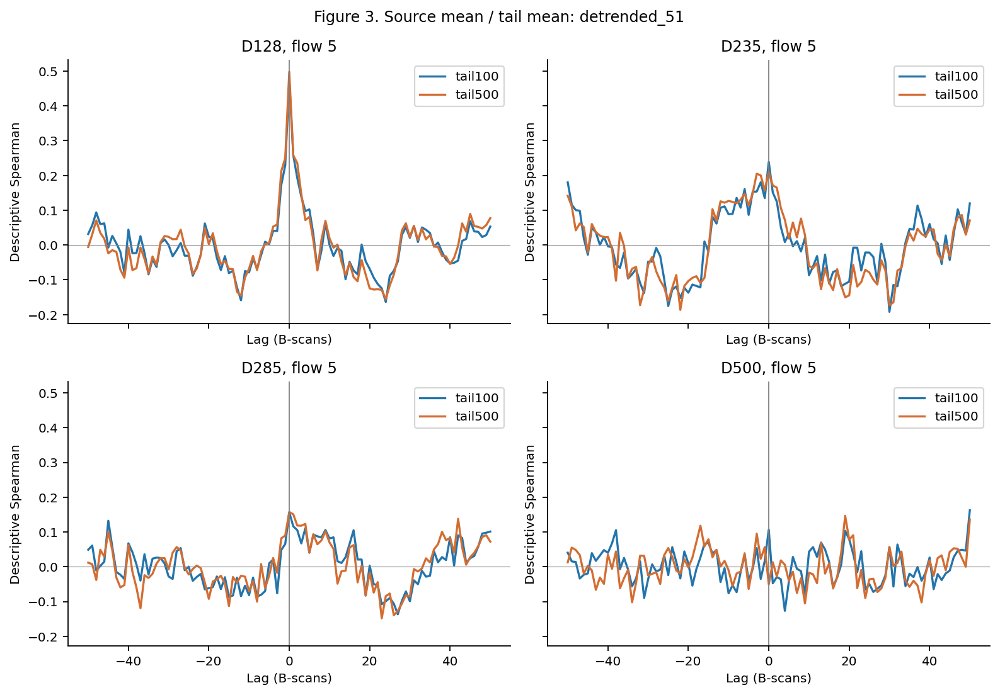

# SV source–tail 逐 B-scan 空间耦合分析 v1

本目录完成四直径 SV-OCTA 冻结 source 与其下方 tail 的逐 B-scan 空间关系计算。结果仅描述 **within-volume spatial association / spatial covariation**。每个 diameter × flow 只有一个独立 scan volume；B-scan 是该 volume 内的空间位置。所有结论和汇总均以 scan volume 为单位。

起始 HEAD：`0d1c428d901447f17d0fa600b37dfdfa41e776dd`。分支：`analysis/sv-diameter-stage2`。结果提交 SHA 由包含本目录的 Git commit 标识，并在交付消息中报告；JSON 中不嵌入无法自引用的最终 commit SHA。

## 输入与覆盖

主分析为 D128、D235、D285、D500 × 1/3/5/7/10 mm/s，共 20 个 volume、9,456 个有效 B-scan。D500 的 2/9/12 mm/s 是独立扩展，共 3 个 volume、1,475 帧。全体 23 个 volume 共 10,931 个有效帧；每卷名义帧坐标均为 0–499。准确无效帧数见下表。

| 范围 | volume 数 | 有效 B-scan | 无效 geometry B-scan |
| --- | --- | --- | --- |
| common_grid | 20 | 9456 | 544 |
| d500_extension | 3 | 1475 | 25 |

| 直径 | 有效帧数（含扩展） |
| --- | --- |
| D128 | 2422 |
| D235 | 2225 |
| D285 | 2371 |
| D500 | 3913 |

输入身份、文件 SHA256、字节数和用途均记录于 [input_manifest.csv](input_manifest.csv)。本轮复用正式验证过的 CSV；D128 缺少直接保存的 100 μm tail Q，因此从本地保留的 25 个 release ZIP 中逐帧读取 `sv_raw`，调用原有 `quantify_raw_sv` 直接积分。25 个 ZIP 及 2,422 个有效帧 NPZ 均与冻结清单核对 SHA256；成员身份记录于 [d128_array_identity_audit.csv](d128_array_identity_audit.csv)。没有重建 `.oct`。

| 变量/直径 | 正式输入（仓库相对路径） |
| --- | --- |
| D235/D285/D500 geometry、source 和 tail mean/Q/area | `analysis/formal_sv_diameter_v1/framewise_primary.csv` |
| D128 source/tail500 均值和 RI 参考 | `analysis/formal_sv_d128_v21_run001/no_background_relative_tail_v1_full2422/framewise_primary.csv` |
| D128 observed raw Q/area 参考 | `analysis/formal_sv_d128_v21_run001/observed_tail_intensity_full2422/observed_tail_intensity_framewise.csv`（只读取 observed 数值用于核对） |
| D128 tail100/500 exact-window mean/area 参考 | `analysis/formal_sv_d128_v21_run001/no_background_followup_three_audits_v1_full2422/window_framewise.csv.gz` |
| D128 冻结 geometry/数组包身份 | `results/formal_sv_d128_v21_full2500_run001/{localization.csv,arrays_sha256.csv,download_packages.csv}` |
| D128/D235 Upper/Middle/Lower | `analysis/sv_diameter_stage2_scientific_v1/d128_d235_source_axial_audit/d128_d235_source_axial_framewise.csv` |
| D285/D500 Upper/Middle/Lower | `analysis/sv_diameter_stage2_scientific_v1/d500_source_axial_audit/source_axial_band_framewise.csv` |
| 23 卷 Stage 2 中位数和计数参考 | `analysis/sv_diameter_stage2_scientific_v1/all_volume_metrics_with_d500_extension.csv` |

D128 release：`formal-sv-d128-v21-run001`，仓库 `bulbel-magnolia/OCTA-`。D235/D285/D500 的逐帧 `input_sha256` 是 retained formal MAT 的 SHA256，来自正式表；三段输入的前次验证已按这些 MAT 身份重放。本轮复用这些已验证派生量，没有再次声称逐一重放 D235/D285/D500 MAT。D128 统一表中的 `input_sha256` 对应本轮重新核验的 release NPZ。

## 冻结量纲与几何

正式信号始终是 `SV_raw(x,z) = Var_t(|E(x,z,t)|)`，即 MATLAB `var(abs(IMG),1,3)`，方差分母为 N。仅使用 linear raw SV；没有 log、CV²、gain、clipping、positive truncation、background subtraction 或定量 normalization。历史 observed 表包含 corrected 列，但这些列没有进入本轮定量输入。

沿用 continuity-first v2.1：中心 X4、表观横向跨度 X1、冻结 z_top；**X1 不等于真实物理血管直径**。source 为 X1 横向跨度 × physical diameter 的椭圆，dx=12.7 μm、dz=6.7 μm、16×16 supersample。Upper/Middle/Lower 使用同一椭圆内物理轴向坐标 u 的 [0,1/3)、[1/3,2/3)、[2/3,1] 分区，保留原 subpixel 权重。Tail 为 X1 宽矩形，从 `z_top + diameter_um / 6.7` 开始，guard=0，分别积分 100 和 500 μm。

`Q = Σ SV_raw × fractional_pixel_weight × dx × dz`；mean=Q/ROI area。Q 的单位为原始 SV 单位 × μm²，mean 为原始 SV 单位，area 为 μm²。D128 的缺失 Q 从数组直接积分；本轮未用任何 volume/segment 中位数乘面积估计逐帧 Q。

## 分析定义与预先固定选择

每一卷单独计算，全部有效 geometry 帧保留；不追加按信号、流速或几何取值的排除规则。统一 CSV 只包含有效帧；计算时重建 0–499 的完整整数坐标，缺失帧为 NaN，从不填零或插值。

Spearman 采用每个配对集合内的 average ranks，再计算 Pearson；最少 3 对，常量序列返回 NaN。未调用任何计算 p-value 的检验接口。本次所有要求的实际相关系数均可定义。`n_pairs` 是空间覆盖信息，不能作为独立实验 n。

主去趋势：`residual = value − centered moving median(value, 51)`；敏感性窗口为 31、101。窗口按原始整数帧坐标定义；两端截短；中位数忽略窗口内 NaN，`min_periods=1`；无效中心帧仍为 NaN。邻域可跨缺失位置取中位数，但窗口宽度不压缩。残差可正可负，仅用于去慢轴趋势诊断，不是新的正式 SV。

相邻差分只计算原坐标 i 与 i+1 均有效的 pair。Lag 的正方向定义为 `Source(i)` vs `Tail(i+lag)`；范围 −50…50，两端不循环。每个 lag 重新选择 pairwise-valid 配对并重新排秩。raw 和 51-frame residual 为主曲线，31/101 为敏感性曲线。

`rho_peak` 是该曲线最大的有符号 rho，不是最大绝对值；完全相等的峰取 |lag| 最小者，再取较小有符号 lag。`zero_lag_rank = 1 + count(rho_lag > rho_lag0)`，为 competition rank。`zero_lag_specificity = rho_lag0 − median(rho at 30 ≤ |lag| ≤ 50)`，远端共 42 个 lag；`peak_within_5` 表示 |lag_at_peak|≤5。边界 ±50 处峰值保留原值，不据此推断窗口以外的位置。峰值是描述性最大值，不作显著性判定。

Partial Spearman：在 complete-case 集合中分别对 X、Y、controls 排 average ranks；以截距和控制变量秩作普通最小二乘，将 X/Y 秩残差化；输出残差 Pearson。分别控制 source_area、z_top、两者。必需 raw 结果外，另输出 31/51/101 残差版本，后者对信号和 controls 都应用同一去趋势。设计矩阵 rank 和系数状态明确输出；常量/完全解释的残差返回 NaN。它不提供因果效应或独立贡献百分比。

只在 volume 层面按 diameter 和 common-flow 范围汇总：原始 5 卷值（JSON 列含 scan_id/flow/value）、median、min–max、正/负/零计数及 lag 峰落在 ±5 帧的卷数。扩展使用单独文件，每项 3 卷。对于 lag/rank 等非相关指标，positive_count 仅表示数值 >0，不能解释为正相关。跨卷未合并 frames 计算相关。没有 t-test、ANOVA、mixed model、frame-level p-value、复杂预测模型或推断性检验。

## 验证结果

数据门禁和计算验证全部通过。三段 Q 重构全 source Q：最大绝对误差 0.015625（Q 的数值量级很大），最大相对误差 5.2793763e-16，达到机器精度量级。23 卷 source、tail100、tail500 和逐帧 RI 的 volume 中位数，与 Stage 2 对照的最大相对误差为 1.08281161e-15。RI 只作冻结结果复核，不作为本轮 coupling 主指标。

独立复核以坐标连接重新计算 2576 条 lag，覆盖全部 23 卷、4 种模式、两种 tail 深度及 mean/Q；使用原坐标距离计算移动中位数，验证缺失与端点处理。还独立重算全部 460 条差分相关，两类最大绝对误差均为 2.22044605e-16。所有 44 个输入清单文件重新核验 SHA256。详见 [validation.json](validation.json)、[independent_verification.json](independent_verification.json) 和 [volume_median_validation.csv](volume_median_validation.csv)。

## 文件与字段

| 文件 | 行单位/内容 |
| --- | --- |
| `framewise_source_tail_metrics.csv` | 10,931 个有效 B-scan，全部冻结几何、source/band/tail mean、Q、area、fraction、数组身份 |
| `volume_zero_lag_coupling.csv` | 每卷 raw source mean/Q 与 tail，以及 area 与 tail mean/Q；184 行 |
| `band_zero_lag_coupling.csv` | 每卷 raw 三段 mean/Q 与匹配 tail；276 行 |
| `volume_detrended_coupling.csv` | 31/51/101 窗口，所有 source、band 和 area 配对；1,380 行 |
| `volume_first_difference_coupling.csv` | 全部连续有效帧 pair 的一阶差分；460 行 |
| `partial_spearman_area_ztop.csv` | raw 和 3 个 residual 模式，source/三段均值 × tail × 3 组 controls；2,208 行 |
| `lag_correlation_raw.csv` | raw 的 37,168 个 volume/predictor/depth/lag 结果 |
| `lag_correlation_detrended_51.csv` | 51 窗口的 37,168 条曲线点 |
| `lag_correlation_detrended_sensitivity.csv` | 31/101 窗口的 74,336 条曲线点 |
| `lag_peak_summary.csv` | 全部 1,472 条 lag curve 的零位、峰值、rank、specificity、有效 pair 数 |
| `tail100_vs_tail500_volume_comparison.csv` | 同卷、同 predictor/mode 的两深度曲线指标，差值均为 100−500 |
| `band_volume_comparison.csv` | 同卷三段 rho 及成对差值；避免用两个组中位数之差代替配对差值 |
| `diameter_common_flow_summary.csv` | 所有分析指标的 5 卷原始值及汇总；主结果 |
| `d500_extension_summary.csv` | 同样指标的 3 卷独立扩展汇总 |
| `volume_frame_coverage.csv` / `volume_pair_diagnostics.csv` | 每卷有效/无效帧及实际连续有效 pair 数 |
| `input_manifest.csv` / `provenance.json` | 输入 SHA256、来源、冻结定义、实现版本和软件版本 |
| `validation.json` / `independent_verification.json` | 主计算与独立坐标连接审计 |
| `figure1`…`figure6` 的 PNG/PDF | 检查图，不替代 CSV |
| `run_analysis.py` / `verify_outputs.py` / `build_readme.py` | 完整可复现分析、独立复核、本文档生成 |

统一表字段：`frame_index` 为 0-based；`valid_geometry=True` 对应正式有效帧。`X1` 是 μm 横向表观跨度，`X1_px` 是像素宽度；`X4` 是冻结中心的 0-based pixel-centre 坐标；`z_top`、`z_bottom_edge_px`、`x_left_edge_px`、`x_right_edge_px` 均沿用冻结 pixel-edge 坐标约定。`diameter_um` 是真实物理直径；`flow_mm_s` 为实验流速。`source_area`、`{upper,middle,lower}_area_um2` 和 `tail_area_um2_{100,500}um` 为 μm²。`*_q_fraction` 是该帧 band Q / source Q。`grid_scope` 分离 common_grid 与 d500_extension。

结果字段：`predictor` 与 `tail_variable` 明确对应列；mean 配对 mean、Q 配对 Q，area 同时配对 mean/Q。`mode` 区分 raw、detrended_31/51/101、first_difference。`rho` / `partial_rho` 为描述性系数；`n_pairs`、`n_pairs_at_lag0`、`n_pairs_at_peak` 为实际空间配对数。`rho_remote_median` 为远端错位中位数。`control_design_rank` 含截距，`status` 说明 partial 是否可定义。汇总 `volume_values_json` 中含每卷原始系数，空白的维度列表示对该分析不适用。CSV 数值以 17 位有效数字输出。

## 图与复现

图 1–3 固定使用 flow=5 mm/s：图 1 为逐帧 source/tail100/tail500 均值，各自除以该卷中位数，仅 **display normalization only**；图 2 为 raw mean lag；图 3 为 51-frame detrended mean lag。图 4 展示全部 20 卷 mean 的 detrended rho_lag0 和 specificity，标签为流速；图 5 展示三段 mean/Q 的 detrended zero-lag，每条线为一卷；图 6 为全部 20 卷 source mean/Q 的 tail100 vs tail500 specificity。



在仓库根目录执行（路径参数指向含 25 个正式 ZIP 的目录）：

```powershell
python analysis/sv_source_tail_framewise_coupling_v1/run_analysis.py --d128-package-root "PATH_TO_FORMAL_D128_ZIPS"
python analysis/sv_source_tail_framewise_coupling_v1/verify_outputs.py
python analysis/sv_source_tail_framewise_coupling_v1/build_readme.py
```

软件版本见 provenance。`--reuse-verified-framewise` 仅在之前完整验证通过、输入 manifest 及统一表 SHA256 未变时复用本轮派生输入。本机路径写在 manifest 用于追溯；异机复现需用相同身份的 release 文件重跑完整流程，生成该机器的新路径 manifest。Raw MAT/NPZ/ZIP 不重复提交 Git。全部新输出位于本目录，冻结文件未改动。无缺失关键变量、未完成分析项或未获支持而填补的数据。

## 纯数据结果：Q1–Q7

以下表格每个单元格均是 **5 个 common-flow volume 的系数 median [min,max]；正值卷数**，不表示以 B-scan 为独立重复的估计。完整原始 5 卷值及三个 D500 扩展值分别保存在相应汇总 CSV。

**Q1：逐帧与去趋势后的 source 均值关系。** D285、D500 的原始逐帧相关在去趋势后下降；D285 主窗口下两种 tail 均为 5/5 正值，D500 tail100 为 5/5、tail500 为 3/5。

| 直径 | tail μm | raw rho | 51-frame residual rho | 相邻差分 rho |
| --- | --- | --- | --- | --- |
| D128 | 100 | 0.427 [0.386, 0.454]; +5/5 | 0.456 [0.400, 0.479]; +5/5 | 0.363 [0.325, 0.417]; +5/5 |
| D128 | 500 | 0.494 [0.389, 0.507]; +5/5 | 0.498 [0.395, 0.548]; +5/5 | 0.437 [0.361, 0.470]; +5/5 |
| D235 | 100 | 0.254 [0.114, 0.287]; +5/5 | 0.239 [0.161, 0.322]; +5/5 | 0.104 [0.073, 0.127]; +5/5 |
| D235 | 500 | 0.245 [0.157, 0.293]; +5/5 | 0.210 [0.174, 0.252]; +5/5 | 0.054 [-0.053, 0.098]; +3/5 |
| D285 | 100 | 0.438 [0.344, 0.600]; +5/5 | 0.203 [0.157, 0.265]; +5/5 | 0.104 [0.024, 0.122]; +5/5 |
| D285 | 500 | 0.608 [0.578, 0.716]; +5/5 | 0.190 [0.157, 0.241]; +5/5 | 0.026 [-0.032, 0.103]; +3/5 |
| D500 | 100 | 0.600 [0.407, 0.634]; +5/5 | 0.104 [0.017, 0.133]; +5/5 | 0.061 [-0.035, 0.118]; +3/5 |
| D500 | 500 | 0.615 [0.542, 0.812]; +5/5 | 0.030 [-0.050, 0.096]; +3/5 | -0.008 [-0.134, 0.004]; +1/5 |

窗口敏感性：D285 的 source mean 在 31/51/101 三个窗口、两个 tail 深度均为 5/5 正。D500 tail100 在 31 帧为 4/5 正，51/101 为 5/5；tail500 在 31/51 帧为 3/5，101 为 5/5。D500 的符号和幅度随诊断尺度变化，不能把 raw 的较高相关直接继承为局部高相关。

| 直径 | tail μm | 31 帧 | 51 帧 | 101 帧 |
| --- | --- | --- | --- | --- |
| D128 | 100 | 0.475 [0.391, 0.491]; +5/5 | 0.456 [0.400, 0.479]; +5/5 | 0.420 [0.381, 0.477]; +5/5 |
| D128 | 500 | 0.499 [0.415, 0.547]; +5/5 | 0.498 [0.395, 0.548]; +5/5 | 0.475 [0.389, 0.506]; +5/5 |
| D235 | 100 | 0.173 [0.077, 0.243]; +5/5 | 0.239 [0.161, 0.322]; +5/5 | 0.269 [0.237, 0.362]; +5/5 |
| D235 | 500 | 0.117 [0.100, 0.160]; +5/5 | 0.210 [0.174, 0.252]; +5/5 | 0.261 [0.220, 0.329]; +5/5 |
| D285 | 100 | 0.172 [0.110, 0.234]; +5/5 | 0.203 [0.157, 0.265]; +5/5 | 0.261 [0.159, 0.276]; +5/5 |
| D285 | 500 | 0.140 [0.124, 0.181]; +5/5 | 0.190 [0.157, 0.241]; +5/5 | 0.275 [0.185, 0.297]; +5/5 |
| D500 | 100 | 0.095 [-0.006, 0.117]; +4/5 | 0.104 [0.017, 0.133]; +5/5 | 0.098 [0.058, 0.142]; +5/5 |
| D500 | 500 | 0.032 [-0.064, 0.101]; +3/5 | 0.030 [-0.050, 0.096]; +3/5 | 0.069 [0.006, 0.101]; +5/5 |

**Q2：零位附近的峰与远距离错位。** D128 的 source mean 两深度、所有主流速在 51 窗口均以 lag=0 为全曲线最高点。D285 的峰全部在 ±2 帧内。D235 的 source 整体峰并非每卷都靠近零位，但 Middle/Lower 的局部峰更一致。D500 source mean 的主窗口峰在 ±5 帧内仅为 tail100 2/5、tail500 1/5。

| 直径 | tail μm | 51 帧 peak lag（flow 1/3/5/7/10） | ±5 帧 | raw 远端 rho 中位数 | 51 帧远端 rho 中位数 | 51 帧 specificity |
| --- | --- | --- | --- | --- | --- | --- |
| D128 | 100 | 0, 0, 0, 0, 0 | 5/5 | 0.010 | 0.005 | 0.451 [0.381, 0.480]; +5/5 |
| D128 | 500 | 0, 0, 0, 0, 0 | 5/5 | 0.015 | -0.001 | 0.495 [0.398, 0.549]; +5/5 |
| D235 | 100 | -6, 0, 0, -46, 0 | 3/5 | -0.084 | 0.012 | 0.214 [0.162, 0.253]; +5/5 |
| D235 | 500 | -6, -1, 0, 0, -2 | 4/5 | -0.044 | 0.025 | 0.185 [0.156, 0.227]; +5/5 |
| D285 | 100 | 0, 2, 0, 0, 0 | 5/5 | 0.180 | 0.021 | 0.193 [0.135, 0.211]; +5/5 |
| D285 | 500 | -1, 1, 0, 0, -1 | 5/5 | 0.389 | 0.025 | 0.155 [0.133, 0.213]; +5/5 |
| D500 | 100 | 0, -1, 50, 20, -34 | 2/5 | 0.503 | 0.007 | 0.098 [0.025, 0.110]; +5/5 |
| D500 | 500 | 1, -40, 19, 46, -30 | 1/5 | 0.560 | 0.007 | 0.023 [-0.052, 0.074]; +3/5 |

D500 raw 曲线在远距离错位仍维持较高 rho，去趋势后远端值接近零，source 整体局部对应也变弱。D285 raw 同时含远端正共变和零位附近的增量；去趋势后仍保留较小的零位附近峰。表中远端中位数不声称 ±50 范围内每一个 lag 都具有相同相关强度。

**Q3：100 μm 与 500 μm。** source mean 的 51-frame specificity，tail100 高于 tail500 的卷数依次为 D128 0/5、D235 3/5、D285 3/5、D500 4/5。proximal tail 的局部优势没有跨四直径一致出现；D500 的优势也不代表所有卷的峰更接近零位。Q 关系给出不同排序。

| 直径 | source 指标 | specificity(100−500) | 100 峰更近零位 | 峰等距 | 100 峰更远 |
| --- | --- | --- | --- | --- | --- |
| D128 | mean | -0.055 [-0.072, -0.018]; +0/5 | 0/5 | 5/5 | 0/5 |
| D128 | q | 0.016 [-0.045, 0.034]; +3/5 | 0/5 | 5/5 | 0/5 |
| D235 | mean | 0.040 [-0.023, 0.097]; +3/5 | 2/5 | 2/5 | 1/5 |
| D235 | q | -0.005 [-0.034, 0.028]; +1/5 | 0/5 | 5/5 | 0/5 |
| D285 | mean | 0.003 [-0.028, 0.048]; +3/5 | 2/5 | 2/5 | 1/5 |
| D285 | q | -0.030 [-0.035, -0.007]; +0/5 | 0/5 | 5/5 | 0/5 |
| D500 | mean | 0.052 [-0.006, 0.152]; +4/5 | 3/5 | 0/5 | 2/5 |
| D500 | q | -0.061 [-0.083, -0.031]; +0/5 | 0/5 | 5/5 | 0/5 |

**Q4：D235/D285 三段。** 主窗口下，Middle 和 Lower 的 mean–mean、Q–Q zero-lag rho 都在各自 5/5 卷高于 Upper，两个 tail 深度均如此。Middle/Lower mean 的峰均在 ±5 帧内，各深度各直径均为 5/5；Upper 只有 D235 tail100 1/5、tail500 0/5，D285 tail100 2/5、tail500 1/5。相邻差分的 mean 相关比主窗口小，部分卷为负，见完整差分表。

| 直径 | 指标 | tail μm | Upper | Middle | Lower |
| --- | --- | --- | --- | --- | --- |
| D128 | mean | 100 | 0.301 [0.283, 0.372]; +5/5 | 0.395 [0.338, 0.421]; +5/5 | 0.339 [0.238, 0.345]; +5/5 |
| D128 | mean | 500 | 0.331 [0.285, 0.418]; +5/5 | 0.434 [0.388, 0.486]; +5/5 | 0.350 [0.234, 0.401]; +5/5 |
| D128 | q | 100 | 0.313 [0.231, 0.376]; +5/5 | 0.367 [0.347, 0.385]; +5/5 | 0.386 [0.350, 0.417]; +5/5 |
| D128 | q | 500 | 0.307 [0.201, 0.388]; +5/5 | 0.357 [0.320, 0.364]; +5/5 | 0.433 [0.383, 0.476]; +5/5 |
| D235 | mean | 100 | 0.124 [-0.027, 0.167]; +4/5 | 0.276 [0.271, 0.409]; +5/5 | 0.259 [0.190, 0.330]; +5/5 |
| D235 | mean | 500 | 0.085 [-0.015, 0.129]; +4/5 | 0.269 [0.238, 0.369]; +5/5 | 0.278 [0.231, 0.344]; +5/5 |
| D235 | q | 100 | 0.106 [-0.020, 0.148]; +4/5 | 0.338 [0.313, 0.443]; +5/5 | 0.495 [0.454, 0.545]; +5/5 |
| D235 | q | 500 | 0.078 [0.023, 0.175]; +5/5 | 0.330 [0.296, 0.370]; +5/5 | 0.575 [0.533, 0.643]; +5/5 |
| D285 | mean | 100 | 0.073 [-0.016, 0.125]; +4/5 | 0.311 [0.179, 0.419]; +5/5 | 0.226 [0.125, 0.284]; +5/5 |
| D285 | mean | 500 | 0.057 [-0.000, 0.078]; +4/5 | 0.295 [0.208, 0.409]; +5/5 | 0.260 [0.179, 0.326]; +5/5 |
| D285 | q | 100 | 0.089 [0.031, 0.272]; +5/5 | 0.404 [0.263, 0.480]; +5/5 | 0.497 [0.477, 0.543]; +5/5 |
| D285 | q | 500 | 0.118 [0.115, 0.301]; +5/5 | 0.308 [0.271, 0.470]; +5/5 | 0.593 [0.540, 0.629]; +5/5 |
| D500 | mean | 100 | 0.089 [0.002, 0.114]; +5/5 | 0.070 [0.006, 0.125]; +5/5 | 0.096 [0.033, 0.238]; +5/5 |
| D500 | mean | 500 | -0.009 [-0.077, 0.110]; +2/5 | 0.027 [-0.004, 0.054]; +4/5 | 0.136 [0.107, 0.250]; +5/5 |
| D500 | q | 100 | 0.188 [0.128, 0.278]; +5/5 | 0.321 [0.262, 0.383]; +5/5 | 0.590 [0.547, 0.603]; +5/5 |
| D500 | q | 500 | 0.206 [0.129, 0.308]; +5/5 | 0.366 [0.349, 0.420]; +5/5 | 0.691 [0.669, 0.716]; +5/5 |

**Q5：D500 三段。** 51-frame residual 不支持 “Upper/Middle > Lower” 的一致排序。Lower mean 的 rho 在两个深度均为 5/5 高于 Middle；Lower > Upper 为 tail100 3/5、tail500 4/5。Q–Q 的 Lower 在两深度均为 5/5 高于 Upper 和 Middle。Tail500 的 Lower mean 局部峰在 ±5 帧内为 5/5、specificity 为 5/5 正；其相邻差分 rho 为 0.113 [0.016,0.251]，5/5 正。Upper mean–tail500 的差分则为 0/5 正。

**Q6：控制 source_area 和 z_top。** raw 与主窗口 residual 的联合控制结果如下。每种控制的单独结果及 31/101 敏感性均在 partial CSV。D285/D500 的 source mean 两深度在联合控制后均为 5/5 正，但幅度不能等同于未控制 raw 高相关。控制后相关上升或排序改变也是本次观测结果，不表示获得因果解释。

| 直径 | tail μm | raw 联合控制 | 51-frame residual 联合控制 |
| --- | --- | --- | --- |
| D128 | 100 | 0.374 [0.319, 0.417]; +5/5 | 0.382 [0.340, 0.404]; +5/5 |
| D128 | 500 | 0.431 [0.270, 0.441]; +5/5 | 0.419 [0.319, 0.473]; +5/5 |
| D235 | 100 | 0.300 [0.281, 0.365]; +5/5 | 0.222 [0.157, 0.282]; +5/5 |
| D235 | 500 | 0.314 [0.274, 0.361]; +5/5 | 0.284 [0.225, 0.297]; +5/5 |
| D285 | 100 | 0.316 [0.247, 0.514]; +5/5 | 0.203 [0.137, 0.268]; +5/5 |
| D285 | 500 | 0.329 [0.292, 0.565]; +5/5 | 0.250 [0.189, 0.294]; +5/5 |
| D500 | 100 | 0.230 [0.168, 0.280]; +5/5 | 0.123 [0.061, 0.169]; +5/5 |
| D500 | 500 | 0.201 [0.155, 0.345]; +5/5 | 0.133 [0.065, 0.168]; +5/5 |

联合控制后的三段主窗口结果，仍为 5 卷中位数 [min,max] 与正值卷数：

| 直径 | tail μm | Upper | Middle | Lower |
| --- | --- | --- | --- | --- |
| D128 | 100 | 0.279 [0.213, 0.344]; +5/5 | 0.304 [0.275, 0.329]; +5/5 | 0.266 [0.214, 0.279]; +5/5 |
| D128 | 500 | 0.323 [0.192, 0.396]; +5/5 | 0.344 [0.308, 0.378]; +5/5 | 0.291 [0.229, 0.328]; +5/5 |
| D235 | 100 | 0.131 [0.044, 0.202]; +5/5 | 0.229 [0.183, 0.338]; +5/5 | 0.189 [0.156, 0.267]; +5/5 |
| D235 | 500 | 0.170 [0.099, 0.235]; +5/5 | 0.294 [0.227, 0.358]; +5/5 | 0.240 [0.201, 0.281]; +5/5 |
| D285 | 100 | 0.064 [0.038, 0.114]; +5/5 | 0.286 [0.156, 0.373]; +5/5 | 0.211 [0.117, 0.244]; +5/5 |
| D285 | 500 | 0.113 [0.102, 0.120]; +5/5 | 0.295 [0.257, 0.404]; +5/5 | 0.244 [0.154, 0.325]; +5/5 |
| D500 | 100 | 0.093 [0.054, 0.162]; +5/5 | 0.075 [0.015, 0.117]; +5/5 | 0.066 [0.013, 0.217]; +5/5 |
| D500 | 500 | 0.116 [0.071, 0.198]; +5/5 | 0.043 [0.013, 0.071]; +5/5 | 0.081 [0.043, 0.206]; +5/5 |

D285 联合控制后，Middle/Lower 在两个深度仍分别为 5/5 高于 Upper。D235 的 Middle > Upper 为 tail100 5/5、tail500 4/5，Lower > Upper 两深度均为 4/5。D500 联合控制后，Upper > Middle 两深度均为 5/5；Lower 与 Upper 的方向混合：Lower > Upper 为 tail100 2/5、tail500 3/5。D500 tail500 的三段中位数为 Upper 0.116、Middle 0.043、Lower 0.081；中位数排序与同卷配对比较不是同一指标，应同时读取。

**Q7：均值、面积、积分与轴向分布。** 四直径呈现不同数据模式，不能分配唯一的“效应来源”。D128 均值局部对应在去趋势和差分下保留。D235/D285 在主窗口有更明显的 Middle/Lower 相对 Upper 的区域差别。D500 的 source mean 去趋势对应较弱，但 source Q–tail Q 仍为 5/5 正；其 source_area–tail Q 同时较高。所有 Q 直接包含逐帧 ROI 面积，source 与 tail 共用 X1，较高 Q 相关不能单独解释成平均强度的高相关。

| 直径 | tail μm | mean–mean | Q–Q | area–tail mean | area–tail Q |
| --- | --- | --- | --- | --- | --- |
| D128 | 100 | 0.456 [0.400, 0.479]; +5/5 | 0.450 [0.418, 0.456]; +5/5 | -0.318 [-0.382, -0.260]; +0/5 | 0.545 [0.431, 0.574]; +5/5 |
| D128 | 500 | 0.498 [0.395, 0.548]; +5/5 | 0.432 [0.415, 0.484]; +5/5 | -0.371 [-0.419, -0.315]; +0/5 | 0.828 [0.792, 0.837]; +5/5 |
| D235 | 100 | 0.239 [0.161, 0.322]; +5/5 | 0.319 [0.244, 0.359]; +5/5 | -0.084 [-0.097, -0.017]; +0/5 | 0.554 [0.539, 0.612]; +5/5 |
| D235 | 500 | 0.210 [0.174, 0.252]; +5/5 | 0.317 [0.256, 0.366]; +5/5 | 0.046 [0.029, 0.124]; +5/5 | 0.838 [0.789, 0.881]; +5/5 |
| D285 | 100 | 0.203 [0.157, 0.265]; +5/5 | 0.292 [0.268, 0.454]; +5/5 | -0.062 [-0.090, -0.017]; +0/5 | 0.668 [0.611, 0.685]; +5/5 |
| D285 | 500 | 0.190 [0.157, 0.241]; +5/5 | 0.310 [0.299, 0.488]; +5/5 | 0.056 [0.043, 0.112]; +5/5 | 0.888 [0.873, 0.902]; +5/5 |
| D500 | 100 | 0.104 [0.017, 0.133]; +5/5 | 0.397 [0.350, 0.431]; +5/5 | 0.076 [-0.043, 0.135]; +3/5 | 0.731 [0.675, 0.771]; +5/5 |
| D500 | 500 | 0.030 [-0.050, 0.096]; +3/5 | 0.432 [0.390, 0.491]; +5/5 | 0.233 [0.210, 0.254]; +5/5 | 0.915 [0.894, 0.920]; +5/5 |

D285/D500 的 raw 均值相关均随去慢趋势明显减弱；D500 的积分关系与面积关系同时保留。D235/D285 的区域差异与 D500 的区域排序并不相同。以上均为本批 volume 内空间共变描述，没有升级为散射机制、因果关系、跨样本推广或论文 Discussion。

source Q–tail Q 的 51-frame 曲线在四直径、两个深度的全部 20 个主分析 volume 中均以 lag=0 为峰。该结果与 mean 曲线的峰分布不同；应连同上表的面积相关读取。

**D500 secondary extension（不混入上述主结果）。**

| flow mm/s | tail μm | 51-frame rho_lag0 | peak lag | specificity |
| --- | --- | --- | --- | --- |
| 2 | 100 | 0.120 | -41 | 0.100 |
| 2 | 500 | 0.040 | -1 | 0.022 |
| 9 | 100 | 0.059 | -3 | 0.050 |
| 9 | 500 | -0.018 | 17 | 0.003 |
| 12 | 100 | 0.061 | 19 | 0.071 |
| 12 | 500 | 0.021 | -47 | 0.027 |

本轮分析到此结束。未增加物理机制解释、论文写作或下一轮实验方案。
