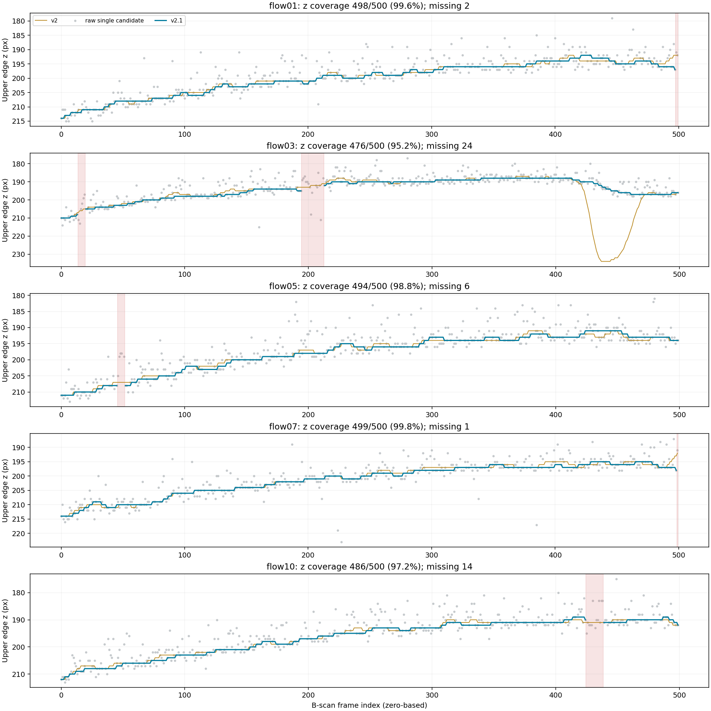
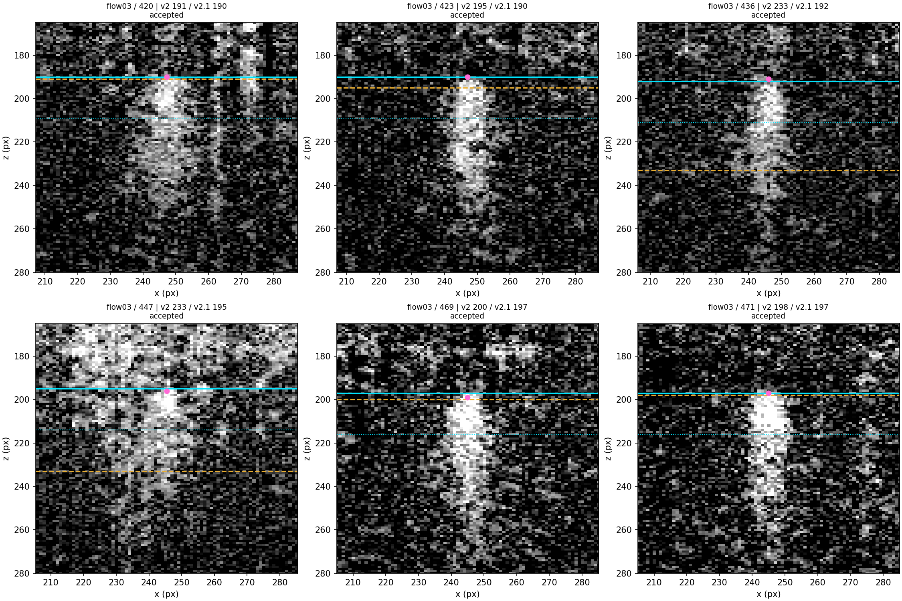
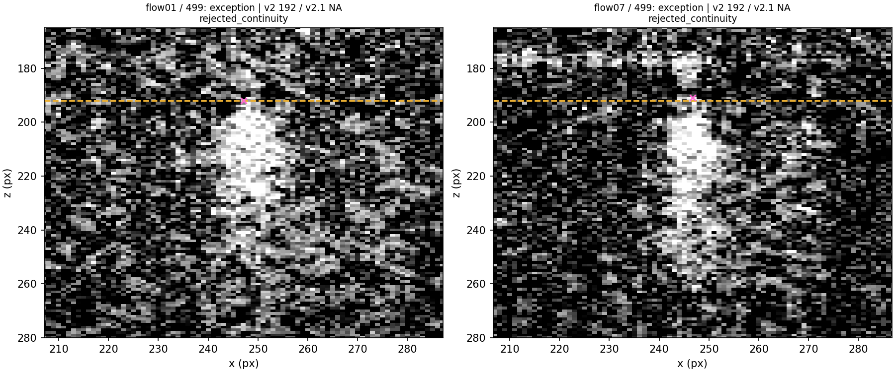

# 纵向血管定位 continuity-first v2.1

本次使用五个原始 Flow DICOM 的全部 2500 帧，验证原有 0、249、499 帧组成的 15 个固定抽样位置。坐标均为 **0 基、z 向下增大**。方法名为 `persistent_core_paired_edge_continuity_first_v2_1`。legacy v1、upper-edge v2 的配置、默认行为和历史结果均保留。

**结果：flow03 深部错误分支消失；定位覆盖 2453/2500（98.12%）。15 个抽样位置中，13 个有定位且与 v2 相差 0–1 px，另 2 个末帧为 NA，不能表述为 15/15 通过。**

## 方法与批准范围

最初按 2 px / 0.6 收紧全卷核心 Viterbi 时，flow03 改选深部路径，420、469 帧的正确单帧候选消失；相同 DICOM 哈希、重跑 v2 的候选和最终上边界均与历史结果一致，排除了输入变化。用户随后明确批准“以上边界约束核心搜索，并在长缺口处重新建立核心轨迹”。本目录为加入该反馈后的最终实现。

1. 保留 v2 单帧 `persistent_upper_edge_candidate` 检测函数及全部强度、支持度和边界判据：alpha=0.20、噪声倍数=4。没有全深度多候选边界搜索、表面距离先验或人工点击。
2. 全卷核心 Viterbi 使用最大相邻跳变 2 px、二次跳变惩罚 0.6，负责初始核心提示。取得可靠上边界后，核心采用因果逐帧搜索：在预测上边界减 3 px 至上边界加物理轴向管径加 3 px 的范围内，以原核心得分减 `0.6 × jump²` 选一个核心；正常相邻核心跳变最多 2 px。这是新增的反馈阶段，不能称为原全卷 Viterbi 的全局最优路径。
3. 局部预测为最近最多 5 个已接受上边界的中位数。采用稳健局部水平，避免将几个噪声候选外推成错误斜坡。新候选相对预测最多偏离 3 px；连续帧间最多变化 2 px；隔 k 帧比较时最大位移为 `2 × k`，同时仍须满足 3 px 预测限制。拒绝的原始 `seed_z_upper_px` 仅供审计，不能进入平滑。
4. 连续超过 5 帧没有被接受的上边界后，重置上边界门控状态。核心重新搜索时保留上一段可靠上边界的局部深度范围，不沿缺失段向下外推。连续 3 个候选同时通过 2 px/帧和 3 px 局部预测限制，才确认重新锁定。离线输出回填这 3 个实测候选，表中同时记录开始帧和确认帧；不是在第一个候选到达时就宣布锁定。
5. 仅补全同一可靠轨迹中、两端均可靠且位置连续的内部缺口，缺失帧总数最多 5。6 帧以上、首尾缺口及重锁定前未确认的候选保持 NA。分别对各段有效输出做 15 帧中值和 sigma=3 帧的高斯平滑，绝不跨最终 NA 段平滑。X 定位和原 v2 候选信号预处理仍沿用原流程。
6. QC 判定函数、分数权重和阈值不变。新增的是缺失定位的完整表结构和审计字段；缺失 z 的帧为 `failed` / `not_assessable`。定位覆盖率与既有几何 QC 有效率分别报告。

配置：[追踪配置](../../config/tracking_config.continuity_first_v2_1.a020_n4.json)、[后续 SV 批处理配置](../../config/run_config.mentor_tracking.continuity_first_v2_1.pilot.json)。后者已准备，但本轮未重算 SV 指标。

## 五卷覆盖率与连续性

| 体积 | z 有效 / 总帧数 | z 排除帧 | z 覆盖率 | 既有几何 QC 有效 | 几何 QC 排除 | 最长 NA 段 | 重锁定次数 |
|---|---:|---:|---:|---:|---:|---:|---:|
| flow01 | 498/500 | 2 | 99.6% | 486 | 14 | 2 | 0 |
| flow03 | 476/500 | 24 | 95.2% | 468 | 32 | 18 | 2 |
| flow05 | 494/500 | 6 | 98.8% | 491 | 9 | 6 | 1 |
| flow07 | 499/500 | 1 | 99.8% | 493 | 7 | 1 | 0 |
| flow10 | 486/500 | 14 | 97.2% | 484 | 16 | 14 | 1 |
| 合计 | 2453/2500 | 47 | 98.12% | 2422 | 78 | 18 | 4 |

有效 z 中，1598 帧为接受的单帧候选，855 帧为两端可靠的短缺口补全（占总帧数 34.2%）；这些补全不能当作独立单帧证据。五卷最终相邻有效上边界的最大跳变均为 1 px；不跨 NA 计算跳变。核心在未重启的连续段内最大跳变也为 1 px。长缺口后的位移单列于 [重锁定事件](relock_events.csv)，没有把跨段位移混入相邻帧指标。

全部缺失段（含端点）：flow01 498–499；flow03 14–19、195–212；flow05 46–51；flow07 499；flow10 425–438。重锁定的开始/确认帧分别为 flow03 20/22、213/215，flow05 52/54，flow10 439/441。

详见 [2500 帧对比](comparison_v2_vs_v2_1_2500.csv)、[体积审计](full_volume_tracking_audit.csv)、[缺失段](missing_segments.csv)。下图红色背景为最终 NA 区间，灰点包含被拒绝的原始候选。



## flow03 关键位置

| 帧 | v2 最终 z | v2.1 原始候选 z | v2.1 最终 z | 原有局部可评估性 |
|---|---:|---:|---:|---|
| 420 | 191 | 190 | 190 | assessable |
| 423 | 195 | 190 | 190 | assessable |
| 436 | 233 | 191 | 192 | assessable |
| 447 | 233 | 196 | 195 | **not_assessable** |
| 469 | 200 | 199 | 197 | assessable |
| 471 | 198 | 197 | 197 | assessable |

425–465 帧不再出现 225–236 px 分支。修正核心搜索后，436、447 帧在浅层找到了通过未修改 v2 判据的候选，其顶缘对比 SNR 分别为 5.62、5.54，持续支持比例分别为 1.00、0.895，所以 z 不是无依据的长距离补全，也没有被强制置 NA。**447 帧的既有整体局部可评估性仍失败，不可进入有效定量。** 469 帧现在处于持续跟踪段，原始候选 199 px、平滑后 197 px，不再需要到该帧才重锁定。

[关键帧数值](flow03_key_frames.csv)、[原始剖面轻量表](flow03_candidate_profiles.csv)、[候选证据图](flow03_candidate_evidence.png)共同记录强度和支持度证据。颜色：黄虚线为 v2；青线为 v2.1 上边界，青点线为操作性下边界；粉色圆点为接受的原始候选，叉号为拒绝的候选。



## 固定 15 帧与两项例外

[15 帧定位及 QC 表](sampled_localization_15.csv)保留全部抽样位置，不用有效帧重新抽样。13 个有定位的位置全部通过原有定位几何 QC，差异仅为 0 或 +1 px。flow01/499 和 flow07/499 输出 NA、QC 无效：

- flow01/499：候选 192 px，局部预测 196 px，偏差 4 px，超出 3 px；前一可靠候选在 497 帧为 197 px。
- flow07/499：候选 191 px，局部预测 197 px，偏差 6 px；前一可靠候选在 498 帧为 198 px，相邻变化为 7 px。

两者都位于体积末端，没有右侧可靠锚点，不能自动补全。这是当前连续性约束下的可用性损失，并不证明这两帧没有真实血管，也不能以自动 QC 取代既有人工认可。



[全部 15 帧对照图](v2_vs_v2_1_sampled_15.png)。本任务完成了五个完整 Flow 体积以及同一批 15 个 B-scan 的定位和原有定位几何 QC 检查。历史清单引用的线性 SV MAT 中间文件在当前机器不可用，因此本次没有重算 Q_vessel、Q_tail、R，也没有将历史指标复制成 v2.1 结果。后续 SV 批处理配置可在原中间文件恢复后使用；本目录不宣称 SV 定量已经重跑。

## 验证、复现和文件边界

Python 完整套件：**55 passed**。新增 11 项测试覆盖大跳拒绝、独立预测门限、1–5 帧可靠补全、长缺口保持 NA、3 候选重锁定及计数重置、NA 分段平滑、端点不外推、强深部拖尾下的核心反馈、整卷定位缺失仍输出无效表。环境中存在 requests 可选依赖版本警告，测试无失败。Windows 沙箱中的 pytest 临时目录权限错误已通过获准的非沙箱测试运行解决。

legacy v1 与 upper-edge v2 在同一 flow03 全部 500 帧上重跑：上边界和原始 z 候选逐帧差异为 0；X 和可评估性分数差异仅在浮点 CSV 舍入级别（<1e-12），QC 分类逐帧一致。见 [兼容性证据](backward_compatibility.json)。历史结果目录没有修改。

从仓库根目录运行（RAW_ROOT 指向原始数据目录，输出目录必须为空）：

```powershell
$env:PYTHONUTF8 = '1'
python scripts/validate_continuity_first_v2_1.py --raw-root "$env:RAW_ROOT" --output outputs/continuity_first_v2_1_validation
python -m pytest -q -p no:cacheprovider --basetemp outputs/pytest_v2_1
```

[validation.json](validation.json)记录代码/配置哈希、软件版本、覆盖率及检查结果；[输入哈希](input_sha256.csv)对应原始 DICOM 的文件名、体积和 SHA-256。`tracking/` 保存各卷 500 帧主表及 alpha=0.15/0.20/0.25 表。公开结果不含本机绝对路径、原始 OCT/DICOM 或 MAT/NumPy 大数组。

局限：连续性不能独立证明解剖正确；初始核心仍依赖全卷 Viterbi；长缺口后的搜索范围依赖上一可靠血管位置，真实大幅漂移可能无法恢复；局部水平预测可能拒绝真实快速变化，末端帧也可能因缺少双端证据丢失。34.2% 的帧仍依赖短缺口补全，不能宣称全部单帧已有直接定位证据。当前仍是定位方法的版本化试运行结果。

哈希说明：无后缀 SHA-256 为实际运行文件字节；`_git_lf` 字段为 Git 按仓库属性转换为 LF 换行后的 SHA-256，便于核对公开仓库。
